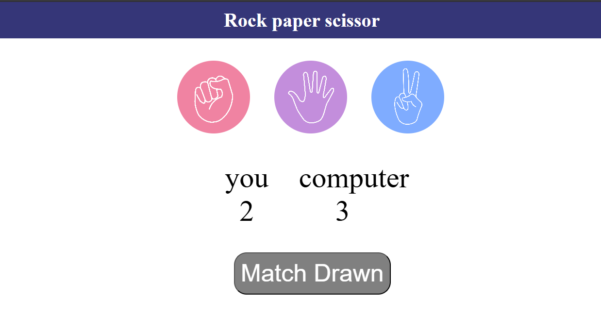

# Rock Paper Scissors 🎮

A simple **Rock-Paper-Scissors** game built using **HTML, CSS, and JavaScript**.  
Play against the computer and keep track of your score!

---

## 🚀 Features
- Interactive UI with Rock, Paper, and Scissors choices
- Scoreboard to track **Player** vs **Computer**
- Dynamic game messages:
  - "You Won"
  - "Computer Won"
  - "Match Drawn"
- Simple design with hover effects

---

## 🛠️ Technologies Used
- **HTML5** – Structure of the game
- **CSS3** – Styling and layout
- **JavaScript (Vanilla JS)** – Game logic and DOM manipulation

---

## 🎯 How to Play
1. Choose **Rock**, **Paper**, or **Scissors** by clicking on the icons.
2. The computer will make its move.
3. The result will be displayed, and scores will update accordingly.
4. Keep playing to test your luck against the computer!

---

## 📸 Demo


---

## 🔮 Future Improvements
- Add animations for better interactivity
- Show history of rounds
- Add reset button to restart scores

---

## 📂 Setup
Clone this repository and open `index.html` in your browser:

```bash
git clone https://github.com/yourusername/rock-paper-scissors.git
cd rock-paper-scissors
